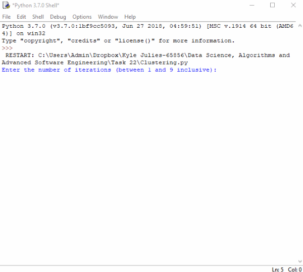

<!--- How to add gif from: https://josephcardillo.medium.com/how-to-add-gifs-to-your-github-readme-89c74da2ce47 --->

## Note
Due to this project being part of the HyperionDev bootcamp, the source code is available in a private repository.
Please contact me if you would like an invitation to the private repository.

# An overview

## A description of how it works
A program that utilises the k-means algorithm in order to converge a set of data.

The data is within excel files. One from 1953, and the other from 2008. It contains three columns, one being the country, the next being the birth rate per 1000, and the last is the life expectancy.

## The purpose
The goal of this program was to understand how to use the k-means algorithm in order to cluster and converge data.

# Contribution
Aspects of the program that can be improved upon:
1. The code can be "cleaned-up", especially some of the methods. There is hard-coding within it, e.g the arrays are hardcoded with index values.

# Licensing
There is no formal licensing for this program, however any distribution, modification and it being packaged to be sold is NOT permissible. Permission will be given by myself for you to download and use the program on your computer, however please remove it once you are done with it.

# Contact information
If you have any further questions, feel free to reach out to me at:
- Email: kylejulies8@gmail.com

# References for the program
There are many references used for this program. See the references.txt file.

